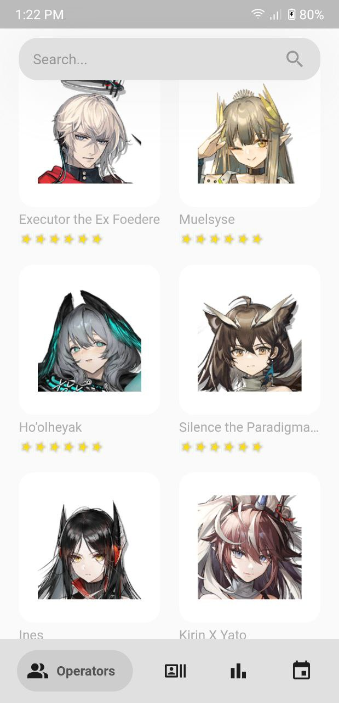
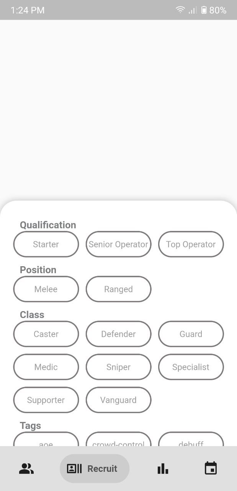
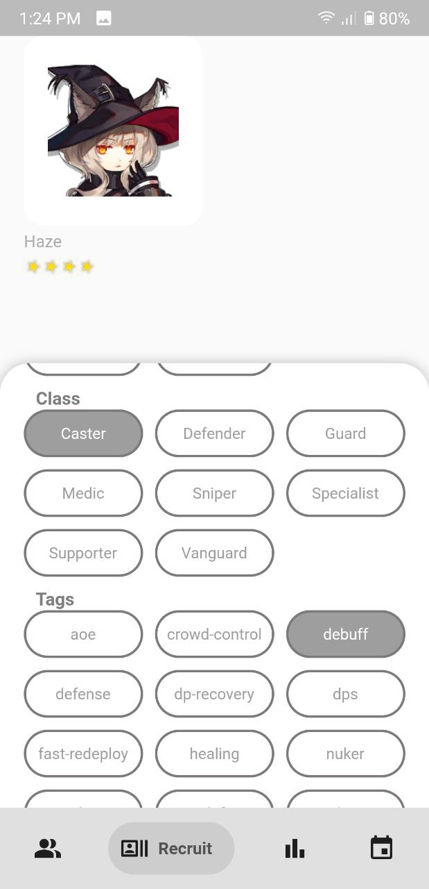
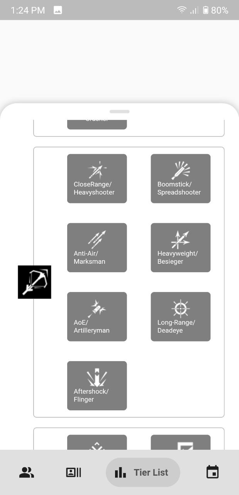
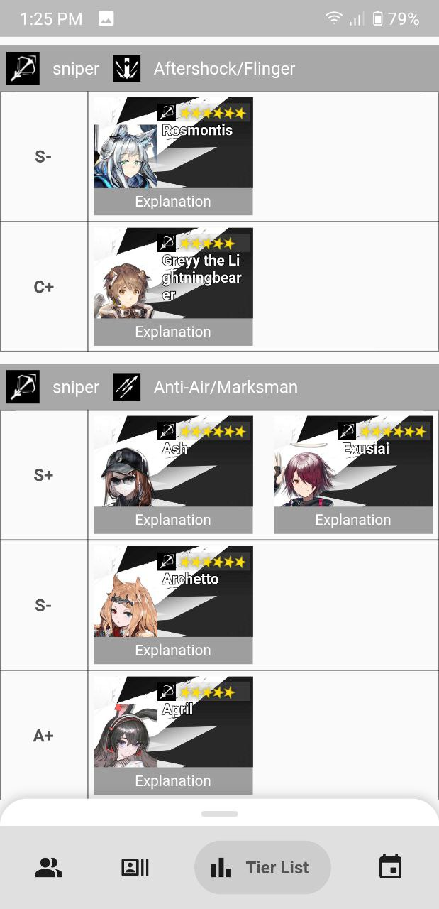
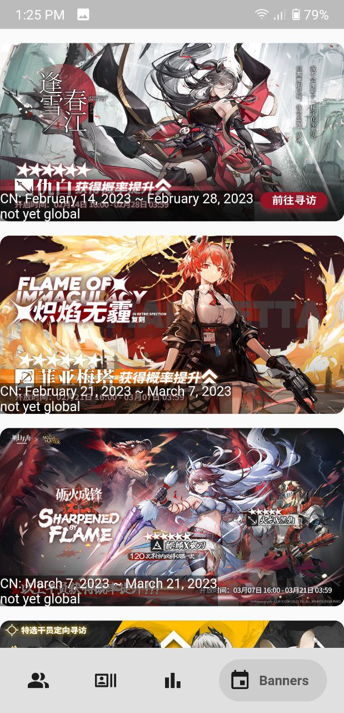
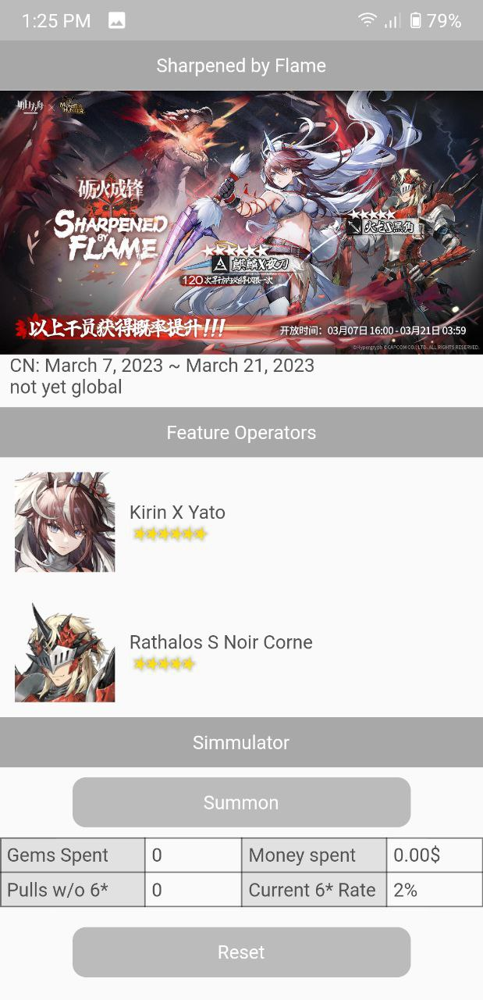
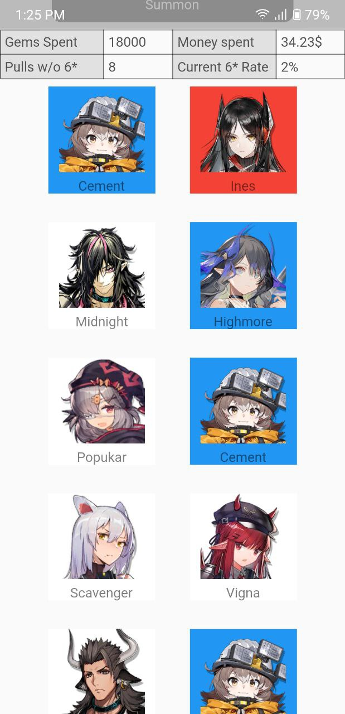

# Arknights wiki

  

Looking for operators information, recruit operators, gacha simulation or perhap tier list? This app will help you!

## Getting Started

For help getting started with Flutter, view our online
[documentation](https://flutter.io/).

## Operators List

<table>
<tr>
<th></th>
<th></th>
</tr>
</table>

## Operators Detail

## Recruit Operators

<table>
<tr>
<th></th>
<th></th>
</tr>
</table>

## Tier List

<table>
<tr>
<th></th>
<th></th>
</tr>
</table>

## Gacha Simulator

<table>
<tr>
<th></th>
<th></th>
<th></th>
</tr>
</table>

### Development / Setup

Follow the [project setup for building A9wiki](https://github.com/sin1102/A9Wiki-client/wiki/Project-setup-for-building-A9Wiki) instructions to get the project running.
